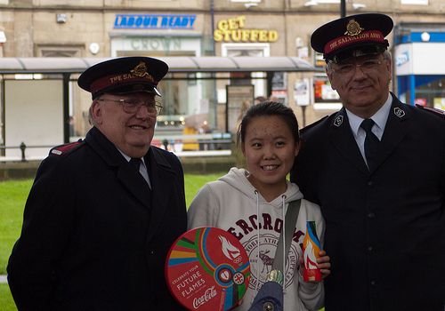

# ANLS: Average Normalized Levenshtein Similarity

[](https://github.com/shunk031/ANLS/actions/workflows/ci.yaml)


This python script is based on the one provided by [the Robust Reading Competition](https://rrc.cvc.uab.es/?com=introduction#) for evaluation of the InfographicVQA task.

## The ANLS metric

The Average Normalized Levenshtein Similarity (ANLS) proposed by [[Biten+ ICCV'19](https://arxiv.org/abs/1905.13648)] smoothly captures the OCR mistakes applying a slight penalization in case of correct intended responses, but badly recognized. It also makes use of a threshold of value 0.5 that dictates whether the output of the metric will be the ANLS if its value is equal or bigger than 0.5 or 0 otherwise. The key point of this threshold is to determine if the answer has been correctly selected but not properly recognized, or on the contrary, the output is a wrong text selected from the options and given as an answer.

More formally, the ANLS between the net output and the ground *truth answers is given by* equation 1. Where $N$ is the total number of questions, $M$ total number of GT answers per question, $a_{ij}$ the ground truth answers where $i = \{0, ..., N\}$, and $j = \{0, ..., M\}$, and $o_{qi}$ be the network's answer for the ith question $q_i$:

$$
    \mathrm{ANLS} = \frac{1}{N} \sum_{i=0}^{N} \left(\max_{j} s(a_{ij}, o_{qi}) \right),
$$

where $s(\cdot, \cdot)$ is defined as follows:

$$
    s(a_{ij}, o_{qi}) = \begin{cases}
    1 - \mathrm{NL}(a_{ij}, o_{qi}), & \text{if } \mathrm{NL}(a_{ij}, o_{qi}) \lt \tau \\
    0,                               & \text{if } \mathrm{NL}(a_{ij}, o_{qi}) \ge \tau
    \end{cases}
$$

The ANLS metric is not case sensitive, but space sensitive. For example:

[](https://rrc.cvc.uab.es/?ch=11&com=tasks)
> Q: What soft drink company name is on the red disk?
>
> Possible answers:
> - $a_{i1}$ : Coca Cola
> - $a_{i2}$ : Coca Cola Company

| Net output ($o_{qi}$) | $s(a_{ij}, o_{qi})$ | Score (ANLS) |
|:---------------------:|:--------------------------------:|--------------:|
| The Coca              | $a_{i1} = 0.44$, $a_{i2} = 0.29$ | 0.00          |
| CocaCola              | $a_{i1} = 0.89$, $a_{i2} = 0.47$ | 0.89          |
| Coca cola             | $a_{i1} = 1.00$, $a_{i2} = 0.53$ | 1.00          |
| Cola                  | $a_{i1} = 0.44$, $a_{i2} = 0.23$ | 0.00          |
| Cat                   | $a_{i1} = 0.22$, $a_{i2} = 0.12$ | 0.00          |

## Installation

```shell
pip install git+https://github.com/shunk031/ANLS
```

## How to use

## From CLI

```shell
calculate-anls \
    --gold-label-file test_fixtures/evaluation/evaluate_json/gold_label.json \
    --submission-file test_fixtures/evaluation/evaluate_json/submission.json \
    --anls-threshold 0.5
```

```shell
❯❯❯ calculate-anls --help
usage: calculate-anls [-h] --gold-label-file GOLD_LABEL_FILE --submission-file SUBMISSION_FILE [--anls-threshold ANLS_THRESHOLD]

Evaluation command using ANLS

optional arguments:
  -h, --help            show this help message and exit
  --gold-label-file GOLD_LABEL_FILE
                        Path of the Ground Truth file.
  --submission-file SUBMISSION_FILE
                        Path of your method's results file.
  --anls-threshold ANLS_THRESHOLD
                        ANLS threshold to use (See Scene-Text VQA paper for more info.).
```

## From python script

```py
>>> from anls import anls_score
>>> ai1 = "Coca Cola"
>>> ai2 = "Coca Cola Company"
>>> net_output = "The Coca"
>>> anls_score(prediction=net_output, gold_labels=[ai1, ai2], threshold=0.5)
0.00
>>> net_output  = "CocaCola"
>>> anls_score(prediction=net_output, gold_labels=[ai1, ai2], threshold=0.5)
0.89
>>> net_output  = "Coca cola"
>>> anls_score(prediction=net_output, gold_labels=[ai1, ai2], threshold=0.5)
1.0
```

## References

- Biten, Ali Furkan, et al. ["Scene text visual question answering."](https://arxiv.org/abs/1905.13648) Proceedings of the IEEE/CVF international conference on computer vision. 2019.
